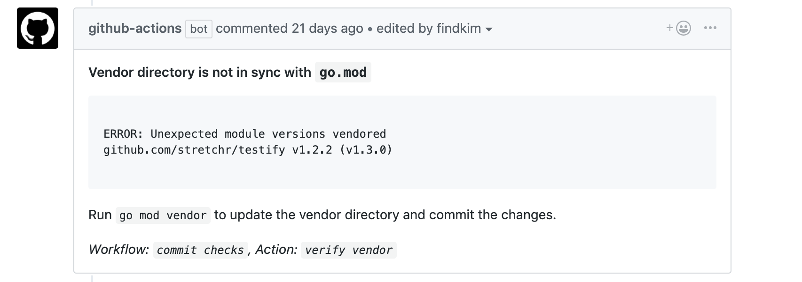

# Verify Vendoring
Compares vendored modules with modules and versions expected from `go mod`, useful for go projects that use both `go mod` and vendoring.

The action runs a vendor check on each push and posts pull request comments with an `ERROR` message to notify that the vendored modules are out of sync with `go.mod`. The action compares the `go.mod` file with `vendor/modules.txt` for expected dependencies and versions. Full logs for the GitHub Action can be found in the Actions tab.



## Recommended Workflow
Add the following workflow to `.github/main.workflow`:

```
workflow "commit checks" {
  on = "push"
  resolves = ["verify vendor"]
}

action "verify vendor" {
  uses = "hashicorp/go-github-actions/vendor-diff@master"
  secrets = ["GITHUB_TOKEN"]
}
```

## Background
Go commands do not use the vendor directory by default even if the vendor folder exists ([GH Issue](https://github.com/golang/go/issues/27227)). The `go.mod` file may be updated during local development with common go commands like `go build` and and `go test` or other go mod subcommands without the explicit `-mod vendor` flag. The vendor directory is not updated without running `go mod vendor` afterwards. This leaves room for dependencies to be updated or added in `go.mod` and not reflected in the vendor. If you're like me and forget this step, you'll be scratching your head as of why production is looking different than your local environment _(psst prod is build with an outdated vendor)_.

There is an open ticket targeted for Go 1.14 milestone to [verify vendored code](https://github.com/golang/go/issues/27348) with `go mod verify`, but until then the GH action hopes to close the gap.

## Logging Levels
### INFO
```
INFO: Vendored modules not required
```

List of modules found in the `vendor` directory that is not expected in `go.mod`.

### WARN
```
WARN: Missing required modules from vendor
```

Missing required modules should error right? This was a design choice to work around some unavoidable discrepancy between the dependency graphs from `go mod tidy` and `go mod vendor`. `go mod vendor` does not include test dependencies whereas other go commands that rely on `go.mod` do. The missing required modules will be logged as a warning and defers the error to the build/test stages using `-mod vendor`.
* Ticket that exemplifies this discrepancy between `go mod tidy` and `go mod vendor`: https://github.com/golang/go/issues/26955
* On going conversation about included dependencies: https://github.com/golang/go/issues/26955

### ERROR
```
ERROR: Unexpected module versions vendored
github.com/stretchr/testify v1.2.2 (v1.3.0)
```

The first version is the vendored version and the version in parenthesis is the expected `go mod` version.
